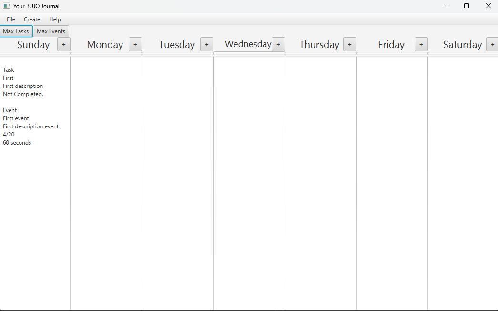
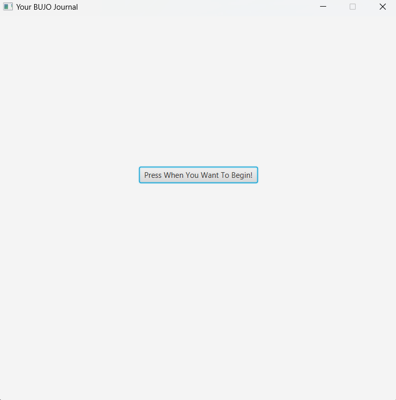
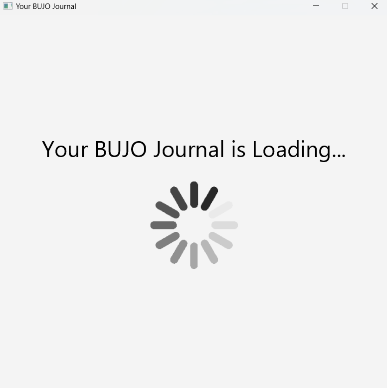
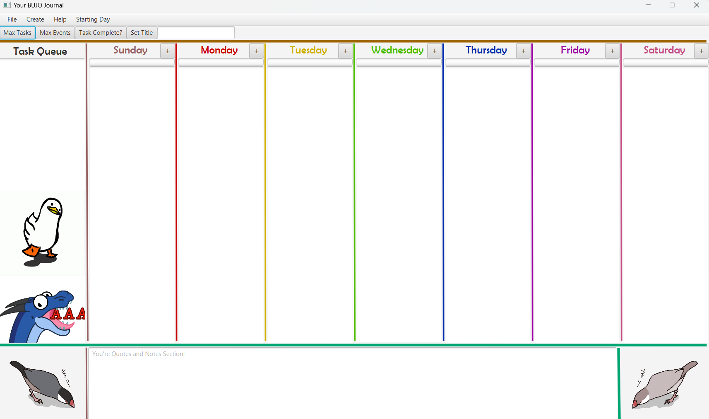

# 3500 PA05 Project Repo

[PA Write Up](https://markefontenot.notion.site/PA-05-8263d28a81a7473d8372c6579abd6481)

Initial BUJO GUI

**Pitch for Program**

Ever find yourself lost on what to do for the week?
Forgetting tasks that you've planned and 
events that you have to attend?

Well fear no more, introducing our BUJO application!
Here you can orgnize your life by doing some of our many
features!
- State-of-the-art menu bar that allows you to 
  - load prior files into your BUJO journal, as well as choosing to keep some
  of their preferences like max tasks and events
  - Save your BUJO journal
  - Create new tasks and events from your menu bar
  - Crazy Customization with the ability to change what day of the week
  you're bujo journal starts with.
- Ability to have a Task Queue on the side of your week so you never
lose focus on your tasks
  - Ability to search up tasks via their name
- Progress Bar and counter for remaining tasks near the top of each week if you set a max task.
- Ability to set max tasks and events
- Ability to mark tasks as complete 
- Ability to use shortcuts to fast track activities like creating a new task and searching for tasks
- Have a weekly overview of your number tasks, events, and the percentage of the way you are with meeting your 
task goal!
- Save some inspiring quotes and notes in our quotes and notes section!
- Keep your notes save with our state-of-the-art password field and encryption technique
- if you mark a task as complete using the button, it reflects in your text area and also the task queue
- A Splash screen and an accompanying loading screen.
- **And much much more!**

Screen you are greeted with

Loading Screen that lasts for 3 seconds

You're colorful BUJO that recently updated to contain rainbow colors for pride month!

How we obeyed the: **SOLID PRINCIPLES**

- S: Each class only has methods that pertain to what that class should be doing.
So our controller class is only working with formatting the FXML files.
Each view is concerned with one FXML file, and the model is doing most of the thinking, with methods 
also being responsible for one general idea
- O: We have methods that are all open for extension but closed for modification. Our records are all open for 
extension, but closed for modification because records are final in nature.
relationship between the interface and classes that implement them are closed for modification. 
- L: Since we did now have any sub classes and super classes present here, we did not need to use the 
Liskov Substitution Principle
- I: Interface Segregation was achieved through separating our journal controller interface and 
Loading controller interface
since we didnt need to use one of the methods in journal controller in our loading controller, 
we seperated the interfaces and made it so a controller didn't have to implement methods it didnt need
- D: We achieved Dependency inversion principle by passing in our journal view into the journal controller
to lessen the coupling in our system.

Image Attributions
- Dancing Duck: https://gifdb.com/gif/dancing-duck-cute-walking-head-bopping-00wvacjyl2zm4nwa.html
- AAAAA Dragon: https://www.furaffinity.net/view/26051293/